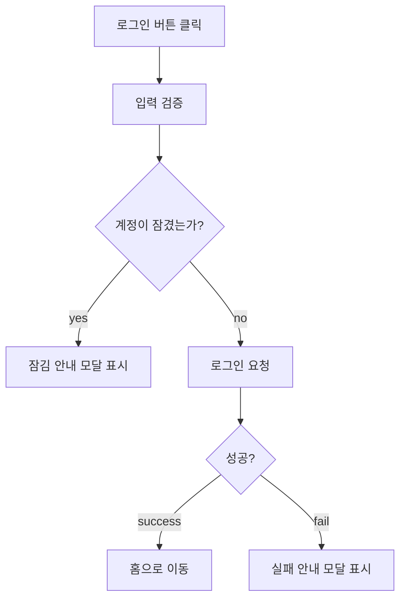
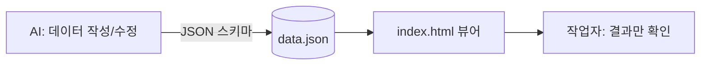

# 로그인 흐름

사용자가 로그인 버튼을 누르면 입력을 검증하고, 결과에 따라 처리가 갈린다.

```mermaid
flowchart TD
  A[로그인 버튼 클릭] --> B[입력 검증]
  B --> C{계정이 잠겼는가?}
  C -- yes --> D[잠김 안내 모달 표시]
  C -- no --> E[로그인 요청]
  E --> F{성공?}
  F -- success --> G[홈으로 이동]
  F -- fail --> H[실패 안내 모달 표시]
```

# 데이터-뷰 분리 구조

```mermaid
flowchart LR
  AI[AI: 데이터 작성/수정] -->|JSON 스키마| DATA[(data.json)]
  DATA --> HTML[index.html 뷰어]
  HTML --> HUMAN[작업자: 결과만 확인]
```
